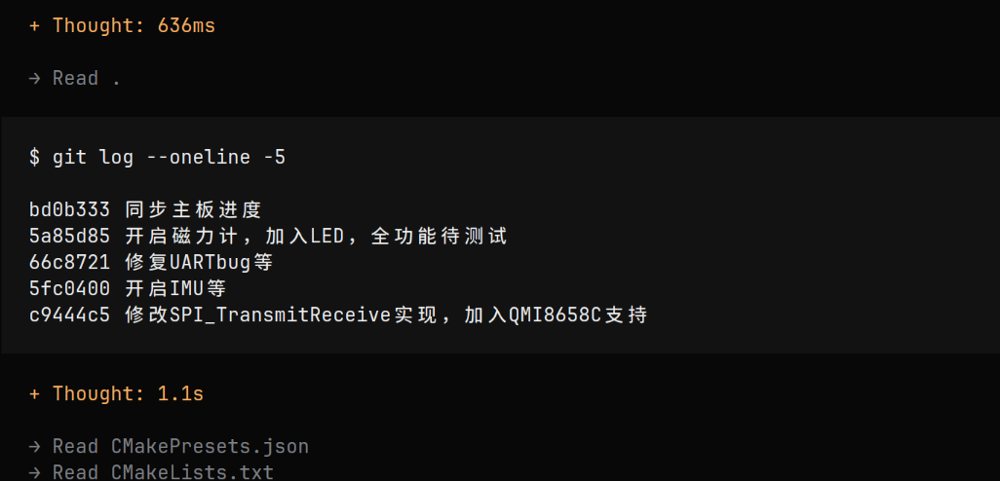
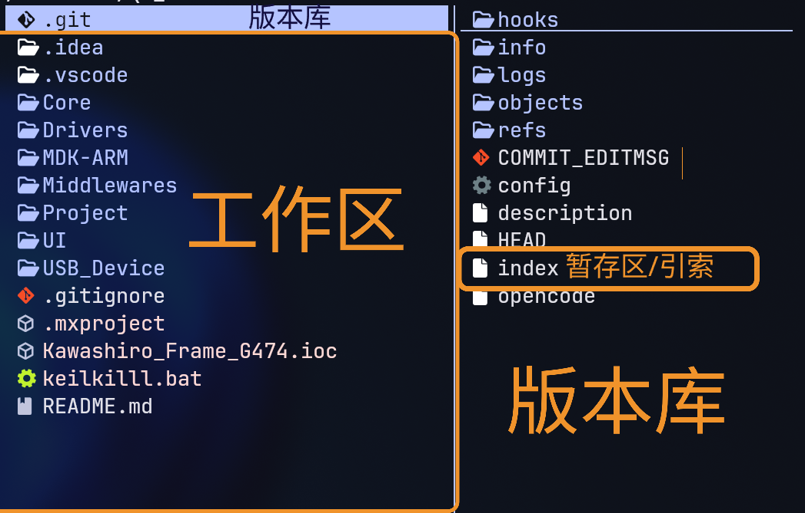

## git是什么，有什么功能  

- 代码存档与回档  
- 分支管理  
- 历史代码对比  
- 多人协作  
- 代码审查与历史追溯  
- 标签与发布  

git与现代IDE深度集成，不用git你的IDE就是不完整的   ~~你只用keil？彳亍~~  

同时，使用AI辅助coding和vibe coding时，AI也会调用git帮助查阅工程  
  

## 入门指南  

### 1. 安装git  

### 2. 基本概念

git仓库分为工作区和版本库。工作区即你的仓库中能看到的目录。工作区有一个隐藏目录 .git不算工作区，是 Git 的版本库，里面存了你的存档，版本库里还有一个文件很重要，叫作暂存区（也叫引索），这个暂存区存放了。

一次存档可以看成：在工作区把代码修修改改，然后再打一个新的存档点，这个过程在实际coding中就是

- git中将存档点称为提交
- HEAD是你所在提交的指针
- git的分支系统可以理解成很多个存档点在一棵树上，主干是main分支，我们自己可以创建分支，一般不在main分支上工作

### 3. 常用命令

---

#### git init 初始化仓库

`git init`

将当前目录初始化为git仓库
> 今后的操作都要在git仓库中进行，要么是自己init，要么clone已有的仓库

---

#### git clone 克隆仓库

从github拉取代码  

`git clone git@github.com:WUST-RM-Control/infantryman-4-2026.git`  

使用ssh从github拉取全向轮步兵整车代码到当前目录  

> clone可以选用https协议和ssh协议，不太了解就用ssh（）
> 若出现`ssh: connect to host github.com port 22: Connection timed out`报错说明有网络问题，可以切换上网方法或者尝试使用https  

---

#### git branch 分支管理

创建、重命名、查看、删除项目分支，通过 Git 做项目开发时，一般都是在开发分支中进行，开发完成后合并分支到主干。

---

`git branch UART`

创建一个名为 UART 的开发分支，分支名只要不包括特殊字符即可。

> 仅创建分支，并不会移动到新分支上

---

`git branch -m UART USART`

如果觉得之前的分支名不合适，可以为新建的分支重命名，重命名分支名为 USART

> -m: move

---

`git branch`

通过不带参数的branch命令可以查看当前项目分支列表

---

`git branch -d daily/0.0.1`

如果分支已经完成使命则可以通过 -d 参数将分支删除，这里为了继续下一步操作，暂不执行删除操作

> -d: delete

---

#### git switch 切换分支

`git switch USART`

切换到UASRT分支
