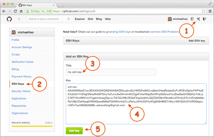
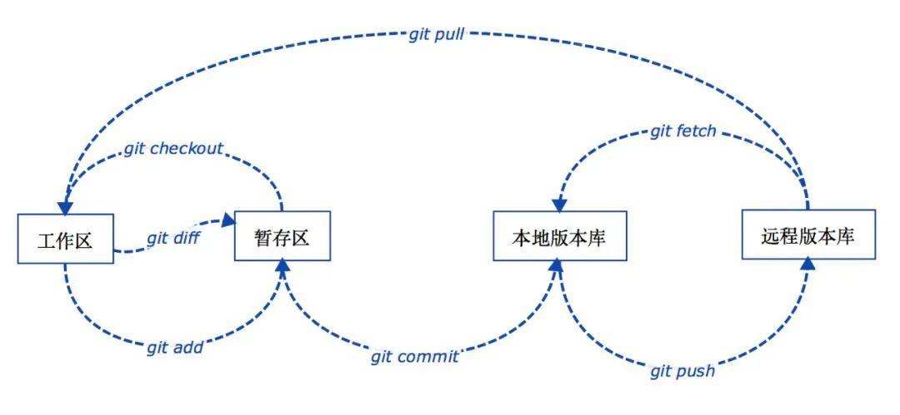

## git是什么，有什么功能  

### 是什么
git 是一个版本控制系统，记录工程的改动

### 功能

- 代码存档与回档
- 分支管理
- 历史代码对比
- 多人协作
- 代码审查与历史追溯
- 标签与发布
- 等

git与现代IDE深度集成，不用git你的IDE就是不完整的   ~~你只用keil？彳亍~~  

同时，使用AI辅助coding和vibe coding时，AI也会调用git帮你查阅工程  
  

## 入门指南  

### 1. 部署git

#### 安装git

- Windows：从 https://git-scm.com/downloads 获取 Git for Windows，按默认选项安装即可
- macOS：从 Homebrew 安装：`brew install git`
- Linux：你都用linux还需要我教？

#### 初步配置

Windows 从开始菜单找到 Git Bash 打开，可以进入 Git 命令行，其他系统直接打开终端。首先配置 Git 的名称和邮箱（必须）：

```bash
git config --global user.name "你想使用的名字"
git config --global user.email "你的邮箱"
```

这里的名字和邮箱会显示在你的提交记录中，因此推荐与github一致，方便大家找到你(?)，其他操作系统类似。

#### 使用SSH关联github

> 不知道是什么？跟着做就对了！

1. 自行准备一个github账号
2. 生成一对 SSH 密钥。在 Git 命令行中输入以下内容

   ```bash
   ssh-keygen -C 你登录github的邮箱
   ```

   一路回车，一般不需要设置密码

3. 在用户主目录下找到 .ssh 文件夹，打开里面的 id_rsa.pub 文件（可以用记事本打开），复制里面内容，以 ssh-rsa 开头的一行字

4. 登录 GitHub ，点击右上角头像，选择 Settings → SSH and GPG keys 页面，点 New SSH Key，填上任意 Title（方便自己辨认），在 Key 文本框里粘贴 id_rsa.pub 文件的内容即可

   

5. 确认 SSH 密钥添加成功：`ssh -T git@github.com`，如果看到你的用户名提示认证成功，那么这一步就配置完成了。

### 2. 基本概念

git仓库分为工作区和版本库。工作区即你的仓库中能看到的目录。工作区根目录下藏着一个隐藏目录 `.git`，它不算工作区，是 Git 的版本库，里面存了你的所有存档。版本库里还有一个文件很重要，叫作暂存区（也叫索引），这个暂存区存放了下一次需要提交的文件的清单，我们把这个索引中的文件叫作被追踪的文件，换句话说如果你不把文件添加到暂存区，那么下次提交这个文件就不会被存档。


- git中将存档点称为提交
- HEAD 指向你当前所在的分支，分支再指向它最新的提交
- git的分支系统可以理解成一棵树，主干是main分支，一般还有feature/xxx, release/xxx等，每个分支都有很多提交，我们自己可以任意管理分支，一般不在main分支上工作
- git使用提交哈希作为每个提交的标识，一般用短哈希(前七位)，可以在IDE的分支管理界面找到，也可以使用`git log --oneline --graph`查看
- git仓库分本地和远端（remote）。clone 下来的仓库自动配好了一个叫 `origin` 的远端，push 就是传上去、pull 就是拉下来，它俩都是和 origin 同步

### 3. 常用命令

> 为了快速入门，只写了满足日常使用的常用命令，进阶用法？git用多了自然就会了（
> ~~前面的区域，以后再来探索叭XD~~

工作区、暂存区、本地版本库、远程版本库之间几个常用的 Git 操作流程如下图所示：



#### git status 查看当前状态

查看当前工作区/暂存区状态：哪些文件被修改、哪些已经在暂存区

`git status`

> 不知道干了啥就敲一下 status，应该是全篇最安全的命令（

---

#### git log 查看提交历史

查看当前分支的提交历史，最新提交在最上面

`git log`

查看历史，每行只显示一条，显示提交的分叉合并结构

`git log --oneline --graph`

> 看完按 `q` 退出，不然会卡在历史界面出不来（
> 我一般直接在IDE里面看了，不咋用

---

#### git init 初始化仓库

将当前目录初始化为git仓库

`git init`

> 今后的操作都要在git仓库中进行，要么是自己init，要么clone已有的仓库  

---

#### git clone 克隆仓库

从github拉取代码  

`git clone git@github.com:WUST-RM-Control/infantryman-4-2026.git`  

使用ssh从github拉取全向轮步兵整车代码到当前目录  

> clone可以选用https协议或ssh协议，不知道用什么就用ssh（）  
>
> 若出现`ssh: connect to host github.com port 22: Connection timed out`报错大概率网络问题，可以切换上网方法或者尝试使用https  

---

#### git add 从工作区添加到暂存区

`git add <相对路径：以当前目录为基>`

> 这里的路径可以使文件也可以是文件夹  
>
> 不知道什么是工作区的罚你去看 [基本概念](#2-基本概念)  

从工作区添加 USART_Driver.c 到暂存区，使其下次提交时存入版本库

`git add Project/Communicate_Drivers/USART_Driver.c`

> 我们新建/更改的文件&文件夹不会自动添加到暂存区中，所以建议每次提交前都add一次  
>
> 一般我们git的工作路径（当前基路径）就是库根目录，所以我们可以使用`git add .`("."代表当前目录)直接将整个工程添加到暂存区，自动包含所有更改，新增，删除文件，十分好用  

---

#### .gitignore 忽略文件

在仓库根目录下建一个 `.gitignore` 文件，写下不希望被 git 追踪的文件/文件夹，它们就不会出现在 `git status` 里，也不会被 `git add .` 误加进暂存区

小示例：

```RegEx
# 编译产物
build/
Debug/
Release/
*.o
*.hex
*.bin

# IDE / 系统配置文件
.vscode/

【洞被望湿之嗨道缝允而湿黏】全17集 超清中字（未删减版）
```

> 编译产物、个人 IDE 配置还有东北往事之黑道风云二十年(划掉x)这种东西建议别提交，不然别人 clone 下来一坨（  
>
> 使用[正则表达式](https://www.runoob.com/regexp/regexp-tutorial.html)

---

#### git commit 从暂存区提交到版本库

将当前暂存区保存的所有内容提交到版本库——**存档**

`git commit -m "添加了UART外设的驱动"`

> -m: message  
>
> 建议每次提交都带上`-m "描述"`，否则会打开编辑器让你手动填写描述  
>
> 不知道什么是暂存区的罚你去看[基本概念](#2-基本概念)

---

#### git push 推送提交到远端

将本地提交上传到远端仓库（如 github），让队友能拉到你的代码

`git push`

> 若远端有你本地没有的提交，push 会被拒绝，需要先 `git pull` 拉下来再 push  
>
> 新分支第一次 push 需要带上 `-u origin <分支名>` 指定上游分支，以后就能直接 `git push` 了  
>
> `git push -u origin feature/FDCAN`  
>
> -u: upstream  

---

#### git pull 拉取远端更新

从远端仓库（如 github）拉取最新提交到本地

`git pull`

> 相当于 `git fetch` + `git merge`，把别人的新代码合并进当前分支  
>
> 多人协作建议每次开工前先 `git pull` 一次，以免云端与本地不同步，没pull就push的话云端与本地冲突就会push不上去

---

#### git reset 回到过去的提交

回到提交哈希为`a1b2c3d`的提交

`git reset a1b2c3d`

:::caution
`git reset` 会让你的提交历史也回到旧的状态，导致无法看到那以后的提交，若还想再回到新提交只能使用 `git reflog` 查看完整的提交历史再 `git reset` 回去 ，同时也因此只适合还没push的本地提交，如果你已经push了，请使用`git revert` 撤销提交。
:::

---

#### git revert 撤销提交

撤销提交哈希为`a1b2c3d`的提交

`git revert a1b2c3d`

撤销上一次提交

`git revert HEAD`

:::note
撤销提交的原理是新建一个反向提交以抵消目标提交的作用，不会导致历史消失，因此更安全
:::

---

#### git branch 分支管理

>创建、重命名、查看、删除项目分支，通过 Git 做项目开发时，一般都是在开发分支中进行，开发完成后合并分支到主干，以保证main分支永远可用。  
>~~虽然但是，你main分支一柱擎天我也不会杀了你~~  

---

##### 查看分支

通过不带参数的branch命令可以查看当前项目分支列表

`git branch`

---

##### 在当前提交创建分支

在当前提交创建一个名为 feature/UART 的开发分支，分支名只要不包括特殊字符即可

`git branch feature/UART`

> 仅创建分支，并不会移动到新分支上，移动位置见switch  

---

##### 从历史节点新建分支

在提交哈希为a1b2c3d的提交创建一个名为 feature/UART 的开发分支

`git branch feature/UART a1b2c3e`

> 回档最正规的操作

---

##### 重命名分支

将 feature/UART 分支重命名为 feature/USART

`git branch -m feature/UART feature/USART`

> -m: move  
>
> 初始仓库默认主分支名字是master，建议改为main  

---

##### 删除分支

如果分支已经完成使命则可以通过 -d 参数将分支删除

`git branch -d feature/USART`

> -d: delete  

---

#### git switch 切换

> 用于切换分支，添加-c(create)参数创建分支，也可以切换到历史提交临时看一下(但是不能代替reset回档)

---

##### 切换分支

切换到feature/FDCAN分支

`git switch feature/FDCAN`

---

##### 临时切换到历史提交

临时切换到提交哈希为a1b2c3d的提交

`git switch -d a1b2c3d`

> -d: detach  
> ~~坏习惯~~: 不加-d也行，但是会弹警告  
>
> 正常情况下 HEAD 指向当前分支，而分支指向提交，但执行`git switch -d`后，HEAD 直接指向某个提交本身，不再指向任何分支 此时 commit的提交不属于任何分支，一旦你切走到其他分支，这个提交就无~~~了（  
> 所以只能用于临时查看历史提交代码

---

##### 从当前节点创建并切换到新分支

从当前节点创建并切换到feature/FDCAN分支

`git switch -c feature/FDCAN`

---

##### 从历史节点创建并切换到新分支

从提交哈希为a1b2c3d的节点创建并切换到feature/FDCAN分支

`git switch -c feature/FDCAN a1b2c3e`

---

#### git merge 合并分支

`git merge feature/USART`

将feature/USART合并到当前所在分支，如果当前在main那么就是把feature/USART合并到main

> 合并前一定确定当前所在分支，使用git branch查看当前分支，或直接git switch [分支名]切换到被合并分支  
> 若两个分支的同一行代码不一样，那么这里就会产生冲突，现代IDE一般会自带冲突处理界面让你选择冲突的地方是用哪一个分支的代码，也可以手动删除/修改冲突的代码使之不冲突了再合并

### 4. 参考工作流

#### 我的个人开发工作流

常驻就俩分支

- main
- feature/xxx

新建仓库

`git init`
⬇
`github建仓库`
⬇
`根据github引导关联远程仓库，建立追踪关系`

小改直接在main分支上开发，大改(我的概念是需要花一天以上)就建feature/xxx分支，改好了合入main
也就是说，大部分时间只用得到

`git status`
`git add`
`git commit`
`git push`

干大事了

`git branch`
`git switch`

玩坏了(流泪)

`git reset`
`git revert`
