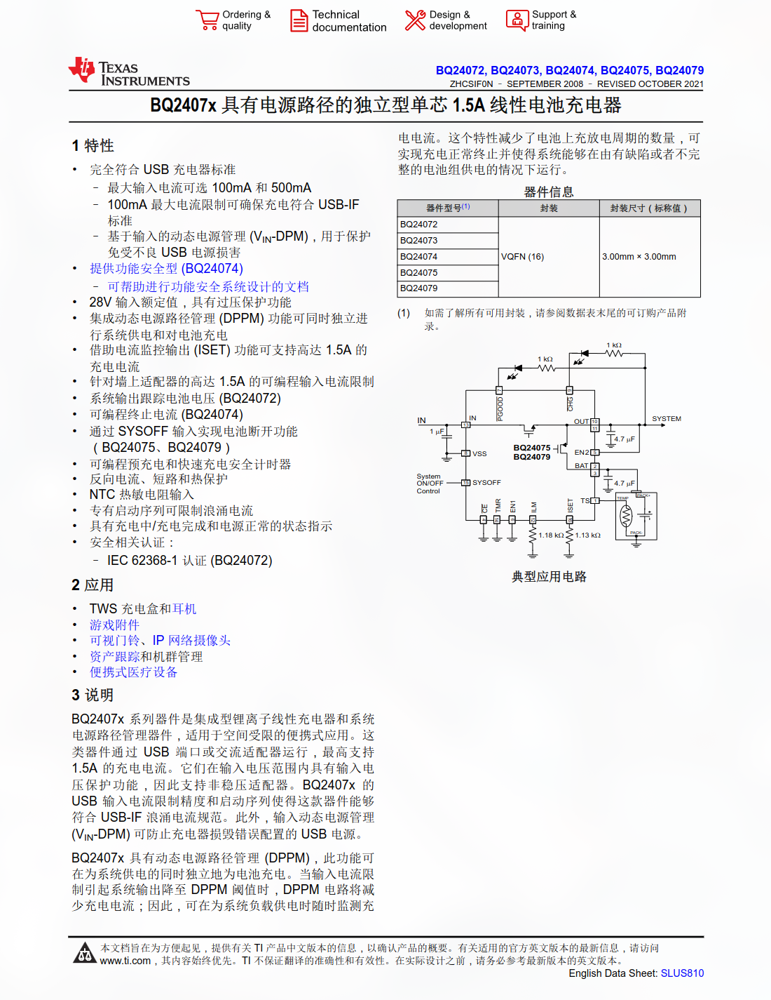

# 电源路径管理与电池充放管理一网打尽

## 前言

这几天做自制装甲板，本来是只想给灯带接个电池接个开关速速完事的，结果越来越贪心，功能越加越多()，最后变成了一套完整的电源路径管理与电池冲放管理系统  
最后实现的功能：可接受USB 5V和XT30 24V外部供电，有任意外部供电时由外部电源为负载供电，同时为电池充电，无外部电源接入时使用电池供电，无MCU芯片，这几乎就是满足带电池产品应用的所有需求了，好欸！

## 实现

最核心的部分是使用了 **BQ2407x** 具有电源路径的独立型单芯线性电池充电器 IC

BQ2407x 系列器件是集成型锂离子线性充电器和系统电源路径管理器件，具有动态电源路径管理 (DPPM)，此功能可在为系统供电的同时独立地为电池充电  
也就是说，它就可以做到有外部供电时边充电边供电，没外部供电时自动切换到电池供电，好欸🤤

## BQ2407x简单介绍

看我介绍不如看一遍手册，不写了()

BQ24073RGTR立创5快一片，淘宝更便宜，好用爱用
